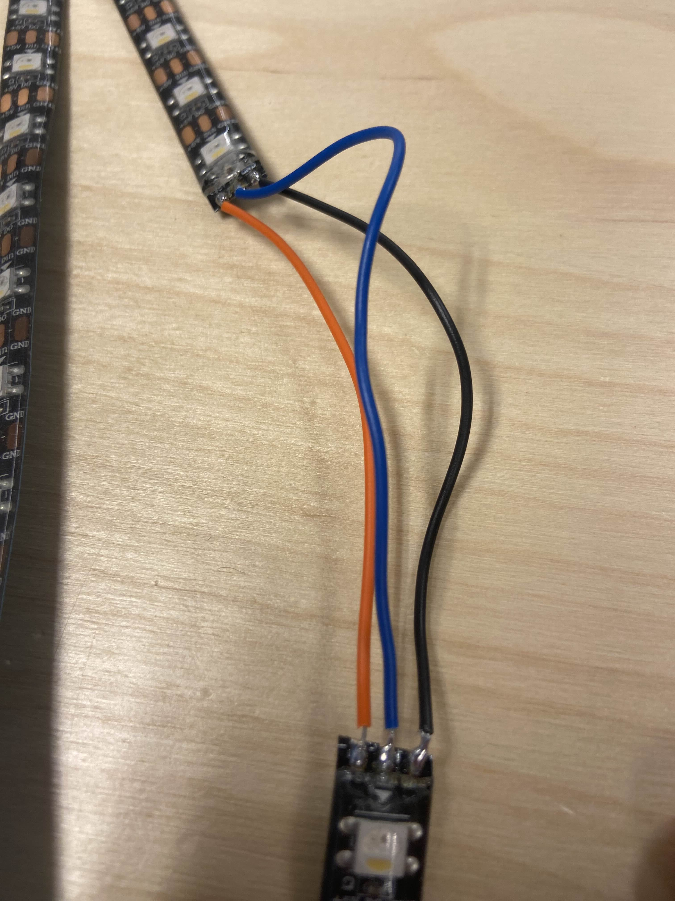
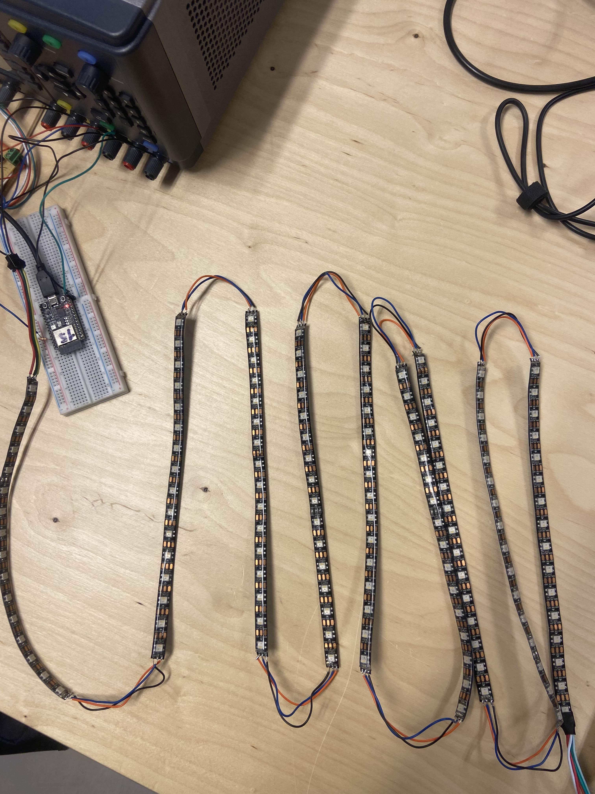
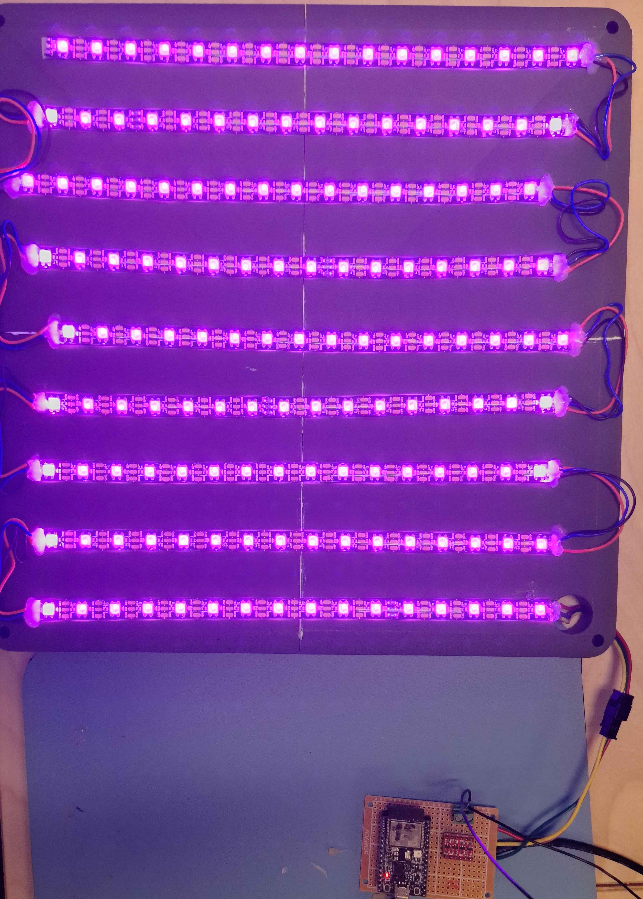

# Install LED strip/Lamp

## Requirements

1. **ledstrip: SK6812 RGBW LED Strip 5m**
2. **SparkFun Logic Level Converter - Bi-Directional**
3. **Soldering material** (Soldering iron, Tin)
4. **ESP32 Microcontroller**
5. Connection cables

## Step 1: Cut and Prepare the LED Strip

Start by cutting the LED strip into 2.5-meter sections. Afterward, cut each 2.5-meter piece into smaller segments, each containing 16 LEDs, resulting in 9 pieces in total.

Next, solder the segments together. Make sure to connect the following:

- **Data (Date)** to **Data Input (Din)**
- **Do (Data Output)** to **Din (Data Input)**
- **GND** to **GND** (Ground)



This will ensure that the LED strip is properly configured for your project.

This should be the final result:



## Step 2: Connect the LED strip to the ESP32

### Electrical schema


---

### Guide on Connections

To properly connect the components, we need to use a **3.3V to 5V level shifter** because the ESP32 sends **3.3V data signals**, while the LED strips require **5V data signals**.

#### Power Supply

- The **5V power source** is used for two purposes:
  1. Supplying power to the **level shifter**.
  2. Feeding power to both the **ESP32** and the **LED strips**.

#### GPIO Connections

- The **first LED strip** is connected to **GPIO2** on the ESP32 (via the level shifter).
- The **second LED strip** is connected to **GPIO3** on the ESP32 (also via the level shifter).

By ensuring this configuration, the ESP32 can reliably control the LED strips without voltage mismatches.


## Step 3: Code

To use the data with **WLED**, we received support from other projects. Below is an explanation of how these contributions were integrated into our setup:

### 1. Sensor Data Reading

The sensor data reading was implemented with help from the [GreenhouseSensoring](https://github.com/vives-project-xp/GreenhouseSensoring) project. For more details on how sensor data is handled, please visit their GitHub repository.

### 2. Data Transmission

The sensor data is sent to another project, [GreenhouseNetwork-Monitoring](https://github.com/vives-project-xp/GreenhouseNetwork-Monitoring). Visit their page for further insights into how the network transmission is managed.

---

## Base Code

The following base code was adapted from **GreenhouseNetwork-Monitoring**:

```python
async def foo():
    # data = hass.states.sensor.greenhouse_10_10_2_48
    # temperature = data.attributes["temperature"]
    # Brightness = data.attributes["brightness"]
    Brightness = 100
    
    #send data to an esp32
    import aiohttp
    import json
    url = "http://10.10.2.2/json/state"
    data = {"bri": Brightness}
    
    headers = {
        'Content-Type': 'application/json'
    }
    
    async with aiohttp.ClientSession() as session:
        async with session.post(url, headers=headers, data=json.dumps(data)) as response:
            response_text = await response.text()
            print(response_text)
```

## Step 4: Connect the ESP to Net current

## Step 5: Installation on serre

### Led strip on lamp

Now the ledstrip can be put onto the 3d printed lamp. You put the ledstrip on the plate of the lamp so that the connector can go true the holes of the plate to connect to the esp on the back side.


