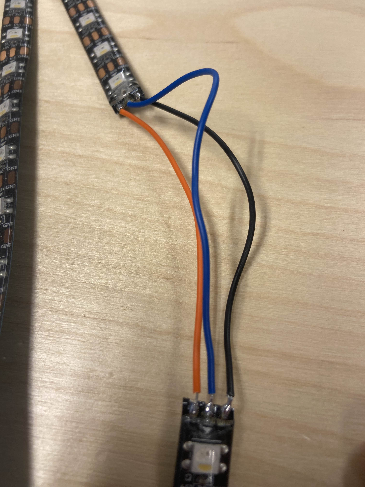
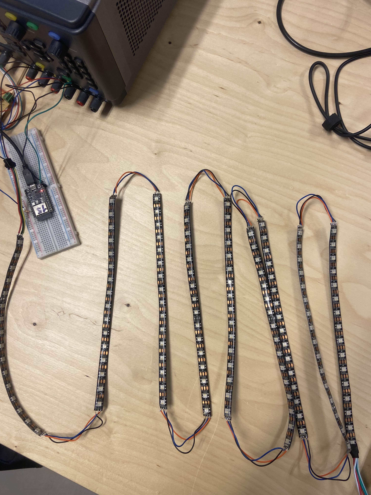

# Install LED strip/Lamp

## Requirements
1. **ledstrip: SK6812 RGBW LED Strip 5m**
2. **SparkFun Logic Level Converter - Bi-Directional**
3. **Soldering material** (Soldering iron, Tin)
4. **ESP32 Microcontroller**
5. Connection cables

## Step 1: Cut and Prepare the LED Strip
Start by cutting the LED strip into 2.5-meter sections. Afterward, cut each 2.5-meter piece into smaller segments, each containing 16 LEDs, resulting in 9 pieces in total.

Next, solder the segments together. Make sure to connect the following:

- **Data (Date)** to **Data Input (Din)** 
- **Do (Data Output)** to **Din (Data Input)** 
- **GND** to **GND** (Ground)
- 

This will ensure that the LED strip is properly configured for your project.
This should be the final result:
- 
