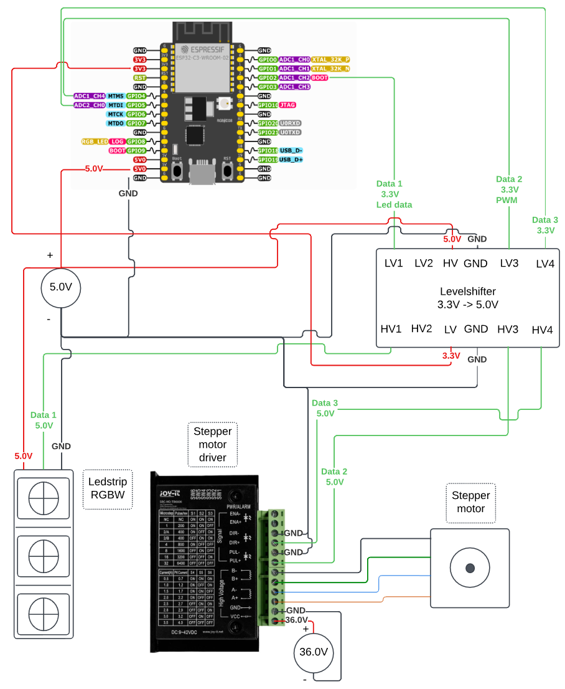

# Install LED strip/Lamp

## Requirements

1. **ledstrip: SK6812 RGBW LED Strip 5m**
2. **SparkFun Logic Level Converter - Bi-Directional**
3. **Soldering material** (Soldering iron, Tin)
4. **ESP32 Microcontroller**
5. Connection cables

## Step 1: Cut and Prepare the LED Strip

Start by cutting the LED strip into 2.5-meter sections. Afterward, cut each 2.5-meter piece into smaller segments, each containing 16 LEDs, resulting in 9 pieces in total.

Next, solder the segments together. Make sure to connect the following:

- **Data (Date)** to **Data Input (Din)**
- **Do (Data Output)** to **Din (Data Input)**
- **GND** to **GND** (Ground)

This will ensure that the LED strip is properly configured for your project.

This should be the final result:

## Step 2: Connect the LED strip to the ESP32

### Electrical schema

---

### Guide on Connections

To properly connect the components, we need to use a **3.3V to 5V level shifter** because the ESP32 sends **3.3V data signals**, while the LED strips require **5V data signals**. We made or own custom board for this.

#### Power Supply

- The **5V power source** is used for two purposes:
  1. Supplying power to the **level shifter**.
  2. Feeding power to both the **ESP32** and the **LED strips**.

#### GPIO Connections

- The **LED strip** is connected to **GPIO2** on the ESP32 (via the level shifter).

By ensuring this configuration, the ESP32 can reliably control the LED strips without voltage mismatches.

## Step 3: Code

Initially, we considered using **WLED** because it is easy to set up and manage. However, we also needed to implement our custom script on the ESP32 to control the **heater** and **shading**. Since integrating WLED with our custom logic proved challenging, we decided to manage the LEDs through our own script instead. This approach allows us to consolidate all sensor data and control logic.

Then to test the basic LED setup u can [upload this code](../../Code/LEDS_Aanstuuren/LEDS_Appart_Aanstuuren.ino) to ur esp32 this should give u purple light on the LEDS.

## Step 4: Connect the ESP to Net current

## Step 5: Installation on serre

### Led strip on lamp

Now the ledstrip can be put onto the [3d printed lamp](../../resources/3D-Tekeningen/PlaatLamp.stl). You put the ledstrip on the plate of the lamp so that the connector can go true the holes of the plate to connect to the esp on the back side.

### Installing it on the serre
