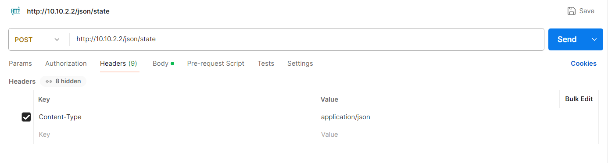
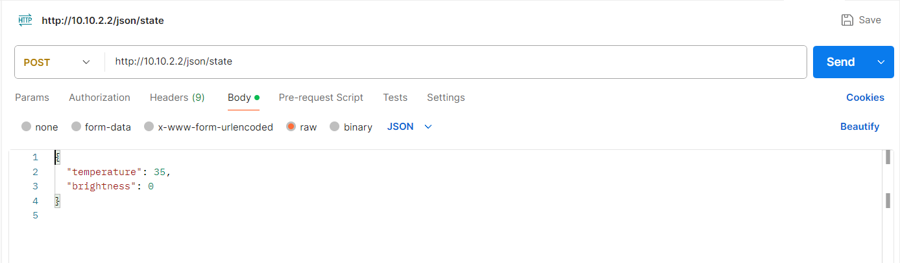

# Installation

## Reviece the data

Before we start we need to be abled to connect the ESP32 to the Wifi and recieve the data from [GreenhouseNetwork-Monitoring](https://github.com/vives-project-xp/GreenhouseNetwork-Monitoring) 

- For this we had to place  [this code snipped](../Code/Sending_date.py) in there code. For more info go to there Github.

- Now to connect the ESP32 to the Wifi and recieve the date we u need to upload [this code snipped](../Code/ResieveData_And_No_WLED/ResieveData_And_No_WLED.ino)  to the esp.

### Postman
- If u dont want to use the other projects or u want to test things without them u can test the ESP32 using [Postman](https://www.postman.com/)

Using these settings: 

Now u shoud be abled to send the data to ur ESP. 

## Step by step guide

1. **Install the LED strip/Lamp:** this can all be found [here](./Lamp_Install_Guide/README.md)
2. **Install shade Shade cloths:** how to install them can be found here [here](./Shade_cloths_Install_Guide/README.md).
3. **Install heater:** if u want to know how we installed the heater that can be found here [here](./Heater_Install_Guide/README.md).

**Its a good thing to test everyting together in a demo setup before u install things on the actual serre!!!** 

The final code can be found [here](../Code/TotalCode/TotalCode.ino).

### Electrical diagram

