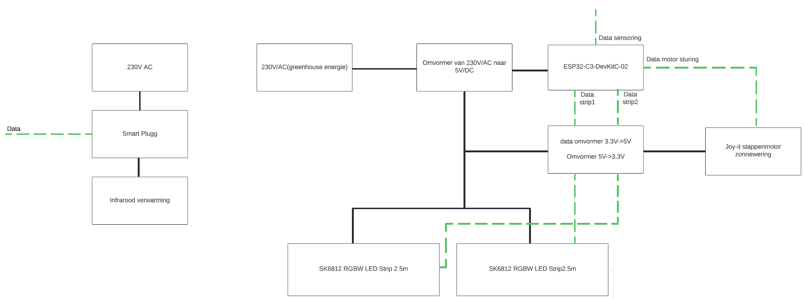
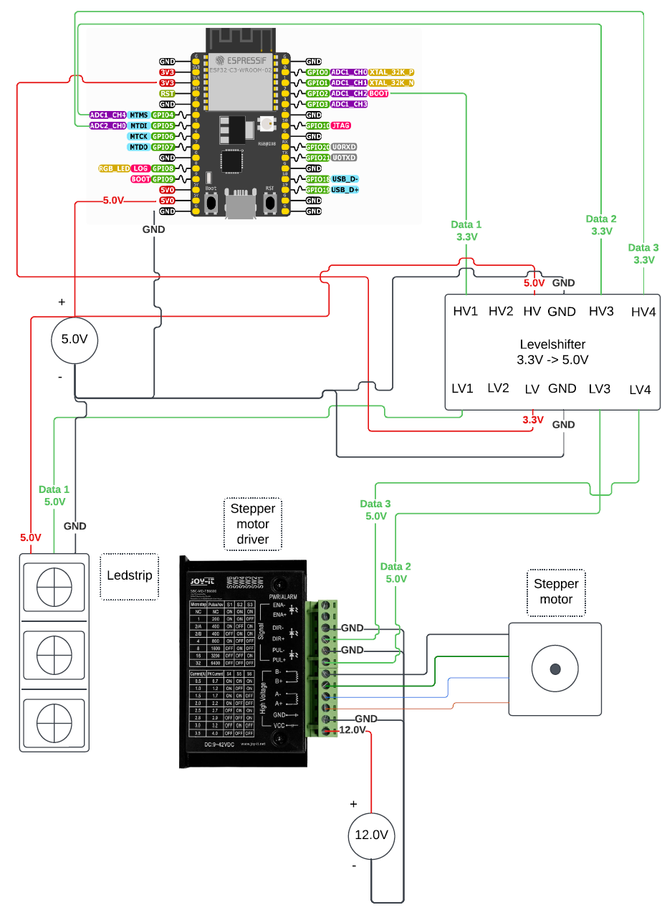

# Documentation 
This is the documentation page. This is the place u need to be if u want to know everything about or hardware witch components we use. How u set up everything ect. 

## Table of context

## Installation

1. **Install the LED strip/Lamp:** this can all be found here (not yet)
2. **Install shade Shade cloths:** how to install them can be found here [here](./Shade_cloths_Install_Guide/README.md).
3. **Install heater:** if u want to know how we installed the heater that can be found hre (not yet)

## Bill of Material
These are all the components we purchased in this project. **Prices may vary depending in the website and date!!**

| Component                                                                                                                                                                                                                                                                                  | Quantity | Price / unit |
| :----------------------------------------------------------------------------------------------------------------------------------------------------------------------------------------------------------------------------------------------------------------------------------------- | :------: | -----------: |
| [**SK6812 RGBW LED Strip**](https://www.btf-lighting.com/collections/sk6812-rgbw/products/1-sk6812-rgbw-4-in-1-pixels-individual-addressable-led-strip-dc5v?variant=45843368149218)                                                                                             |    1     |       €36,36 |
| [**ESP32-C3-DevKitC-02**](https://www.digikey.be/nl/products/detail/espressif-systems/ESP32-C3-DEVKITC-02/14553009)                                                                                                                |    1     |      €7,12 |
| [**stappenmotor**](https://www.conrad.be/nl/p/joy-it-stappenmotor-nema23-02-joy-it-1-2-nm-2-5-a-as-diameter-6-35-mm-2148832.html)                                                                                                                                                                             |    2    |       €23,13 |
| [**verwarmingselement**](https://www.brico.be/nl/tuin-terras-buitenleven/terrasverwarming/terrasverwarmers-accessoires/terrasverwarmers/vonroc-heater-marsili-compact-2000w-zwart/10138731#specs)                                                                                                                                                                                    |    1     |        €41,28 |
| [**level shifter**](https://www.kiwi-electronics.com/nl/sparkfun-logic-level-converter-bi-directional-3154?country=BE&gad_source=1&gclid=CjwKCAjw68K4BhAuEiwAylp3kt7vck5a6xNAdQXR4uiNX7ktb2c63guU_YwqHTPJBu4vWqOJ1PuHGRoCmoIQAvD_BwE)                                                                                                                                                                                |    1     |        €3,51 |
| [**Omvormer 230-5**](https://www.conrad.be/nl/p/mean-well-rs-50-5-schakelnetvoedingsmodule-5-v-dc-10-a-50-w-1297303.html?cq_src=google_ads&cq_cmp=40589428&cq_term=mean+well+rs-50-5&cq_plac=&cq_net=g&cq_plt=gp&adcampaign=google&tid=40589428_140876950727_kwd-547842379393&gad_source=1&gclid=Cj0KCQjwyL24BhCtARIsALo0fSDuCaDh2ffTkAbUqMfxnU9p9Hiimt1URVC2o9y4NEF36lzJeEPr_NQaAln_EALw_wcB)                                     |    1     |       €14,04 |
| [**Smart plug**](https://www.hubo.be/nl/p/wiz-smart-plug-stekker/943560/?srsltid=AfmBOop1jMLLTrlQRWXBZI4sboYYit9EBC_hZCbBdXXBF2tYZz2Lpcub)                                                                                                                                                                                 |    1     |        €13,21 | 
| [**Stappenmotordriver**](https://www.conrad.be/nl/p/joy-it-sbc-md-tb6600-stappenmotordriver-2999126.html?refresh=true)                                                                                                                                                                                 |    1     |        €19,83 | 
| [**voeding driver**](https://www.conrad.be/nl/p/mean-well-uhp-200r-36-schakelnetvoedingsmodule-36-v-dc-5-6-a-201-6-w-2237833.html)                                                                                                                                                                                 |    1     |        €54,54 | 

## Architecture documents

### Hardware architecture diagram

### Wiring architecture diagram

