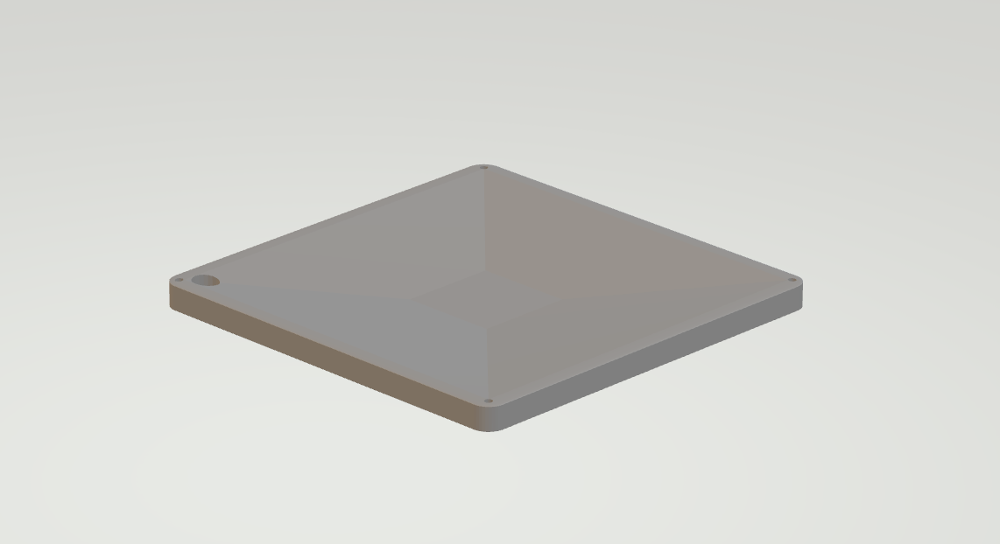
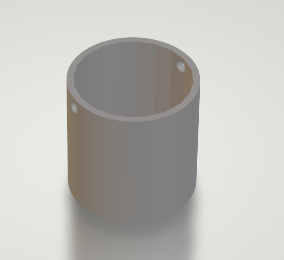

# GreenhouseLight-Heat

# Introduction
This project automates the control of light, heat, and humidity within a greenhouse to optimize plant growth year-round. Through a network of sensors and actuators, the system continuously monitors and adjusts environmental conditions to create the ideal environment for plants.

# The team
 - Thibaut Schroyens (SCRUM Master)
 - Sam De Wispelaere
 - Joren Vandewalle

# features
 - Light Control: Adjusts lighting with blue and red LEDs to stimulate plant growth and manages shading to prevent overexposure.
 - Temperature Regulation: Monitors greenhouse temperature, controlling electric heaters to add warmth or opening windows for cooling.
 - Humidity Management: Monitors humidity levels and reduces excess moisture by opening windows.
 - All LEDs, heaters, and actuators run on standard power (230V), making installation straightforward and accessible without specialized wiring.

# Hardware
 - SK6812 RGBW LED Strip 5m
 - ESP32-C3-DevKitC-02
 - converter(?)
 - Electric motor(?)
 - Shade cloth
 - Lamp construction
 - Shade cloth roll-up construction

# 3D Prints

 - Plate for lamps 
 
 - Corner for attaching shade cloth (?) 
 - Housing for weight (weight = soil) (?)
  
 - Electric motor attachments (?)

# Software
 - The only software used is WLED for controlling our LED's.
 - the rest of the software is provided by the other teams

# Bom list

# Schematic

