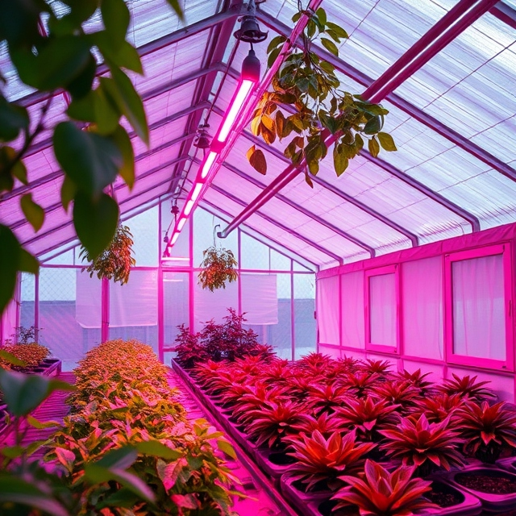

# GreenhouseLight-Heat

# Introduction
This project automates the control of light, heat, and humidity within a greenhouse to optimize plant growth year-round. Through a network of sensors and actuators, the system continuously monitors and adjusts environmental conditions to create the ideal environment for plants.

# The team
 - Thibaut Schroyens (SCRUM Master)
 - Sam De Wispelaere
 - Joren Vandewalle

# features
 - Light Control: Adjusts lighting with blue and red LEDs to stimulate plant growth and manages shading to prevent overexposure.
 - Temperature Regulation: Monitors greenhouse temperature, controlling electric heaters to add warmth or opening windows for cooling.
 - Humidity Management: Monitors humidity levels and reduces excess moisture by opening windows.
 - All LEDs, heaters, and actuators run on standard power (230V), making installation straightforward and accessible without specialized wiring.

# hardware
 - SK6812 RGBW LED Strip 5m
 - ESP32-C3-DevKitC-02
 - converter(?)
 - Electric motor(?)
 - Shade cloth
 - Lamp construction
 - Shade cloth roll-up construction

# BOM

