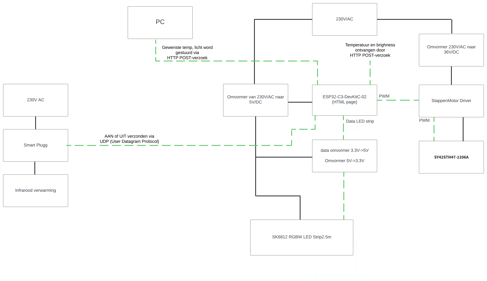

# GreenhouseLight-Heat

## Introduction

This project automates the control of light and heat within a greenhouse to optimize plant growth year-round. Through a network of sensors and actuators, the system continuously monitors and adjusts environmental conditions to create the ideal environment for plants. We don't do everyting on or own we have a group that measure the temprature and light intensity. And one that send us the data.

[GreenhouseSensoring](./Documentatie/README.md).

[GreenhouseNetwork-Monitoring](https://github.com/vives-project-xp/GreenhouseNetwork-Monitoring).

## Our team

- Thibaut Schroyens (SCRUM Master)
- Sam De Wispelaere
- Joren Vandewalle

## features

- **Light Control:** Automated purple lightning based on the current lightintensity.
- **Temperature Regulation:** Monitors greenhouse temperature, controlling electric heaters to add warmth and a shade cloth to try and cooldown the serre.
- All LEDs, heaters, and actuators run on standard power (230V), making installation straightforward and accessible without specialized wiring.

## Hardware

- **ledstrip:** SK6812 RGBW LED Strip 5m
- **esp32:** ESP32-C3-DevKitC-02
- **voedingen:** Mean Well Rs-50-5 (5V-10A) + Mean Well UHP-200R-36 (36V-5.6A)
- **stappenmotor:** SY42STH47-1206A 
- **level shifter:** Sparkfun Logic converter, bi-directional
- **heater:** VONROC heater marsili compact -2000W
- **Smart plug :** Wiz Smart plug
- **stepper motor driver:** Joy-it SBC-MD-TB6600
- **Shade cloth**
- **Lamp construction**
- **Shade cloth roll-up construction**

### Hardware architecture diagram

## Software

- We flash all the code on the ESP using  [Arduino IDE](https://www.arduino.cc/en/software). 

We use there settings for our ESP32 in IDE

### Used librarys
- **WebServer.h:** Handles HTTP server requests
- **ArduinoJson.h:** Parses incoming JSON data.
- **WiFi.h:** Connects the ESP32 to a Wi-Fi network
- **FastLED.h:** Controls the LED strip.
- **WiFiUdp.h:** Used to communicate with the WiZ smart plug via UDP.

## Bom list

These are all the components we purchased in this project. **Prices may vary depending in the website and date!!**

| Component                                                                                                                                                                                                                                                                                  | Quantity | Price / unit |
| :----------------------------------------------------------------------------------------------------------------------------------------------------------------------------------------------------------------------------------------------------------------------------------------- | :------: | -----------: |
| [**SK6812 RGBW LED Strip**](https://www.btf-lighting.com/collections/sk6812-rgbw/products/1-sk6812-rgbw-4-in-1-pixels-individual-addressable-led-strip-dc5v?variant=45843368149218)                                                                                             |    1     |       €36,36 |
| [**ESP32-C3-DevKitC-02**](https://www.digikey.be/nl/products/detail/espressif-systems/ESP32-C3-DEVKITC-02/14553009)                                                                                                                |    1     |      €7,12 |
| [**stappenmotor**](https://www.pololu.com/product/1200l)                                                                                                                                                                             |    2    |       €25,63 |
| [**verwarmingselement**](https://www.brico.be/nl/tuin-terras-buitenleven/terrasverwarming/terrasverwarmers-accessoires/terrasverwarmers/vonroc-heater-marsili-compact-2000w-zwart/10138731#specs)                                                                                                                                                                                    |    1     |        €41,28 |
| [**level shifter**](https://www.kiwi-electronics.com/nl/sparkfun-logic-level-converter-bi-directional-3154?country=BE&gad_source=1&gclid=CjwKCAjw68K4BhAuEiwAylp3kt7vck5a6xNAdQXR4uiNX7ktb2c63guU_YwqHTPJBu4vWqOJ1PuHGRoCmoIQAvD_BwE)                                                                                                                                                                                |    1     |        €3,51 |
| [**Omvormer 230-5**](https://www.conrad.be/nl/p/mean-well-rs-50-5-schakelnetvoedingsmodule-5-v-dc-10-a-50-w-1297303.html?cq_src=google_ads&cq_cmp=40589428&cq_term=mean+well+rs-50-5&cq_plac=&cq_net=g&cq_plt=gp&adcampaign=google&tid=40589428_140876950727_kwd-547842379393&gad_source=1&gclid=Cj0KCQjwyL24BhCtARIsALo0fSDuCaDh2ffTkAbUqMfxnU9p9Hiimt1URVC2o9y4NEF36lzJeEPr_NQaAln_EALw_wcB)                                     |    1     |       €14,04 |
| [**Smart plug**](https://www.hubo.be/nl/p/wiz-smart-plug-stekker/943560/?srsltid=AfmBOop1jMLLTrlQRWXBZI4sboYYit9EBC_hZCbBdXXBF2tYZz2Lpcub)                                                                                                                                                                                 |    1     |        €13,21 |
| [**Stappenmotordriver**](https://www.conrad.be/nl/p/joy-it-sbc-md-tb6600-stappenmotordriver-2999126.html?refresh=true)                                                                                                                                                                                 |    1     |        €19,83 |
| [**voeding driver**](https://www.conrad.be/nl/p/mean-well-uhp-200r-36-schakelnetvoedingsmodule-36-v-dc-5-6-a-201-6-w-2237833.html)                                                                                                                                                                                 |    1     |        €54,54 |

## Step by step plan

For a step by step installition guide click [here](./Documentatie/README.md).
